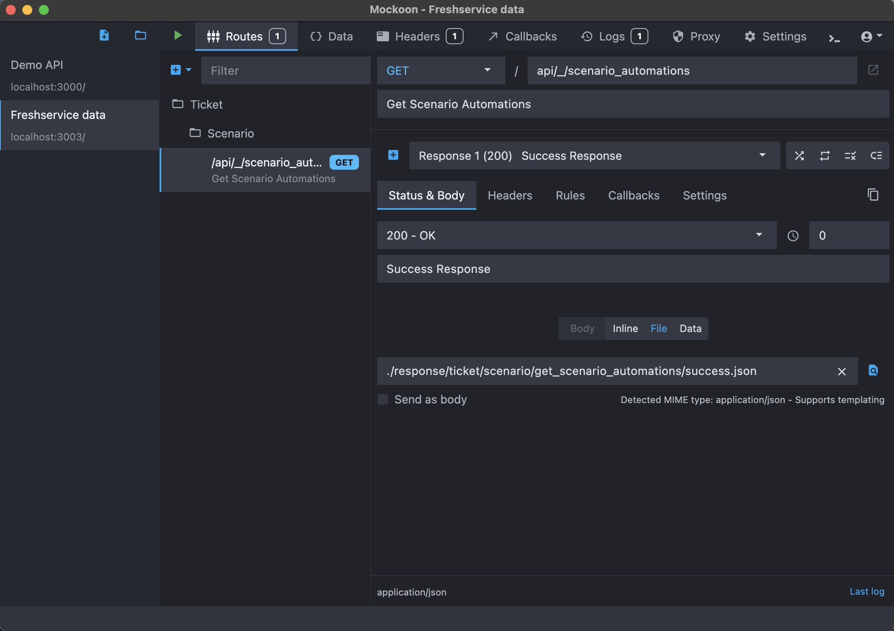

# Freshservice Mock Server Setup

- [Freshservice Mock Server Setup](#freshservice-mock-server-setup)
  - [Mackoon](#mackoon)
  - [Setup using Desktop Client](#setup-using-desktop-client)
    - [Clone Freshservice Mock Server Repository](#clone-freshservice-mock-server-repository)
    - [Download \& Install Mackoon Desktop Client](#download--install-mackoon-desktop-client)
    - [Open Freshservice Environment](#open-freshservice-environment)
  - [Setup using CLI (Command Line Interface)](#setup-using-cli-command-line-interface)

## Mackoon 

We use tool called [Mackoon](https://mockoon.com/) for our Mock Server.

Learn about Mackoon tool using following resources

- [Tutorials](https://mockoon.com/tutorials/)
- [Documentation](https://mockoon.com/docs/latest/about/)

## Setup using Desktop Client

### Clone Freshservice Mock Server Repository

- Repository - [Freshservice Mock Server GitHub](https://github.com/freshdesk/mobile_freshservice_mock_server)

### Download & Install Mackoon Desktop Client

- Download & Install Mackoon desktop client - [Mackoon Desktop Client](https://mockoon.com/download/)

### Open Freshservice Environment

- Open Freshservice environemnt (`freshservice_data.json`) in Mackoon client

## Setup using CLI (Command Line Interface)

Learn how to setup in CLI using following resources

- [Mackoon CLI](https://mockoon.com/cli/)
- [Mackoon CLI GitHub](https://github.com/mockoon/mockoon/tree/main/packages/cli)

